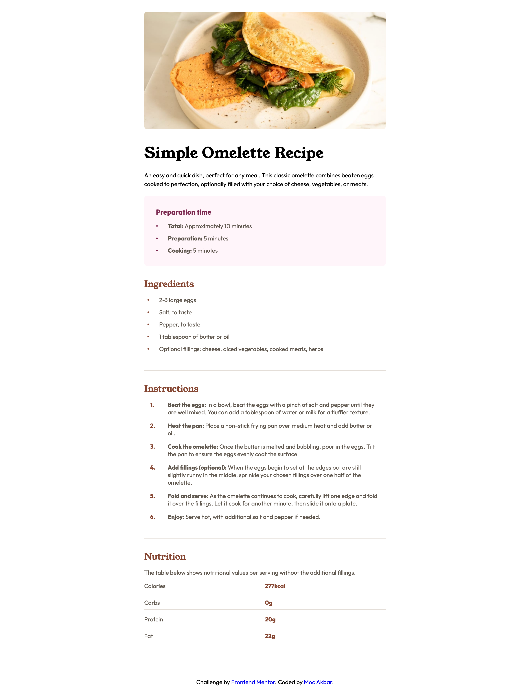
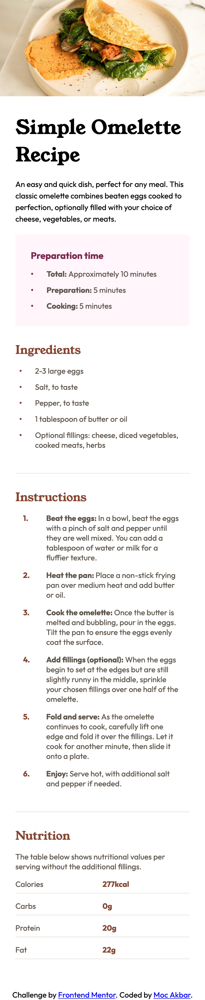

# Frontend Mentor - Recipe page solution

This is a solution to the [Recipe page challenge on Frontend Mentor](https://www.frontendmentor.io/challenges/recipe-page-KiTsR8QQKm). Frontend Mentor challenges help you improve your coding skills by building realistic projects. 

## Table of contents

- [Overview](#overview)
  - [Screenshot](#screenshot)
  - [Links](#links)
- [My process](#my-process)
  - [Built with](#built-with)
  - [What I learned](#what-i-learned)
  - [Useful resources](#useful-resources)
- [Author](#author)

## Overview

### Screenshot
Take a look at how the project looks on different devices:  

<div align="center">
  <table>
    <tr>
      <td><b>💻 Desktop View</b></td>
      <td><b>📱 Mobile View</b></td>
    </tr>
    <tr>
      <td></td>
      <td></td>
    </tr>
  </table>
</div>
 

### Links

- Solution URL: [Gitlab](https://gitlab.com/fe-mentor/receipe-page-main.git)
- Live Site URL: [receipagemain.vercel.app](https://receipagemain.vercel.app/)

## My process

## Built with

- **Semantic HTML5 markup**: Ensures better accessibility and meaningful content structure.
- **CSS Custom Properties**: For easier theming and consistent styling.
- **Flexbox**: Used for flexible layout designs.
- **CSS Grid**: Provides a robust layout system for complex designs.
- **Mobile-first Workflow**: Design approach focused on optimizing mobile user experience first.

### What I Learned

While working on this project, I gained valuable experience in web development, particularly in creating structured HTML and responsive CSS. Here are some highlights:

1. **HTML Semantics and Structure:**
   - Learned the importance of using semantic HTML tags like `<figure>`, `<section>`, and `<ul>` to enhance content organization and accessibility.

   ```html
   <section class="main-content">
     <h1>Simple Omelette Recipe</h1>
     <p class="content">An easy and quick dish, perfect for any meal.</p>
   </section>
   ```

2. **CSS Grid and Flexbox Layouts:**
   - Improved understanding of CSS Grid for list layouts and Flexbox for overall layout adjustment.

   ```css
   .ingredients ul {
     display: grid;
     grid-template-columns: 1.25rem 1fr;
     gap: 0.8rem;
   }
   ```

3. **Responsive Design Techniques:**
   - Enhanced responsive design using media queries to adjust styles for different screen sizes.

   ```css
   @media only screen and (min-width: 768px) {
     .main {
       width: 90%;
       padding: 2rem;
     }
   }
   ```

4. **Typography and Custom Fonts:**
   - Worked with custom fonts and created a consistent visual hierarchy using different font families and weights.

   ```css
   @font-face {
     font-family: "Outfit";
     src: url("./fonts/outfit/Outfit-VariableFont_wght.ttf") format("truetype");
     font-weight: 400;
   }
   ```

5. **Theming with CSS Variables:**
   - Leveraged CSS variables for easier theming and consistent color usage across the project.

   ```css
   :root {
     --white: hsl(0, 0%, 100%);
     --stone-600: hsl(30, 10%, 34%);
     --brown-800: hsl(14, 45%, 36%);
   }
   ```

6. **Accessibility Considerations:**
   - Focused on accessible content structure, including clear headings, descriptive alt attributes, and logical navigation.

These learnings have strengthened my front-end development skills and provided a better understanding of web accessibility, design systems, and responsive layouts.

### Useful resources

- [CSS Breakpoints](https://blog.logrocket.com/css-breakpoints-responsive-design) - This is an amazing article which helped me finally understand breakpoints. I'd recommend it to anyone still learning this concept.

## Author

- Frontend Mentor - [@mocakbar](https://www.frontendmentor.io/profile/mocakbarmaulana)
- Github -  [@mocakbar](https://github.com/mocakbarmaulana)
